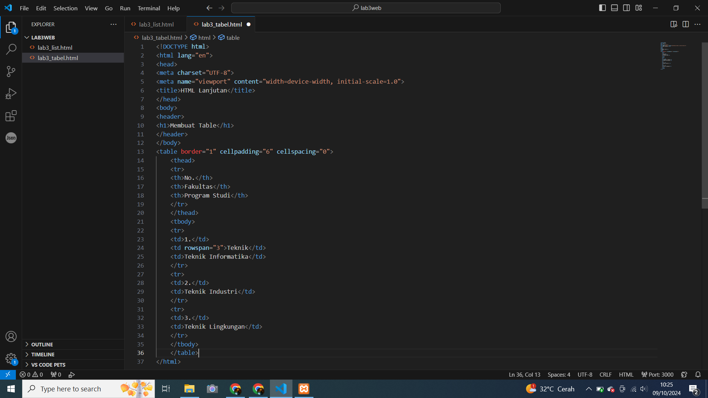
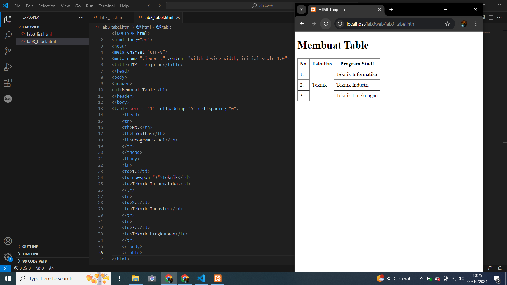
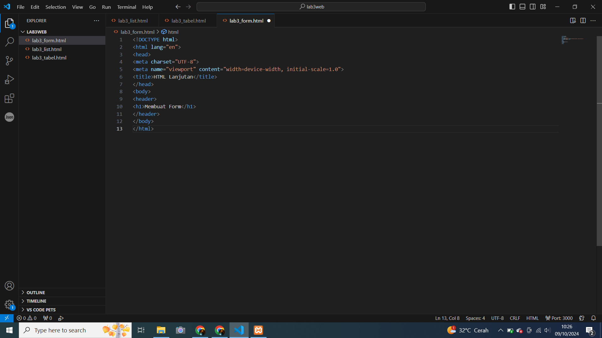
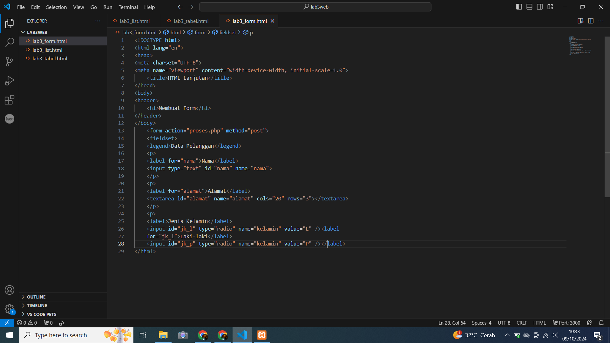
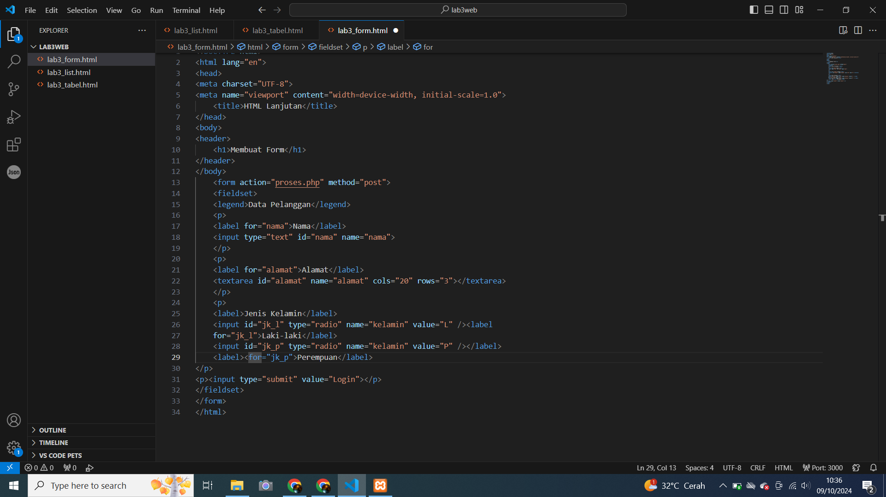
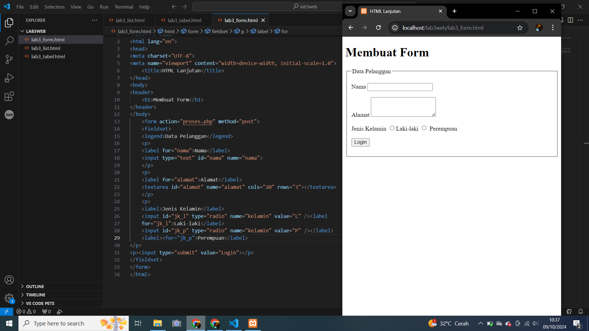
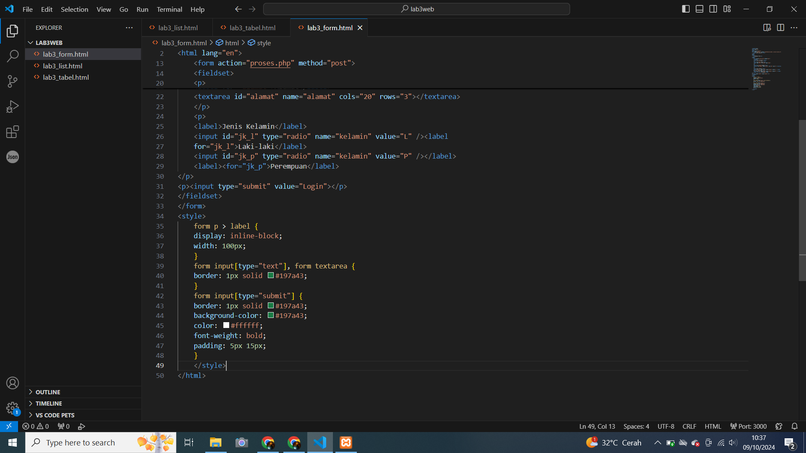
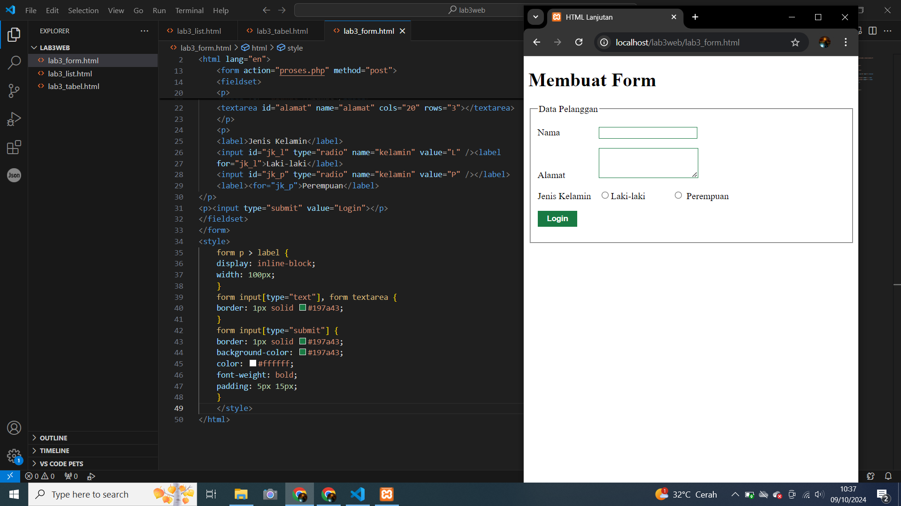

# lab3web
## Nama  : Muhamad Ananda Putra Fraceda
## NIM   : 312310440
## Kelas : TI.23.A4
## 1. Persiapan membuat dokumen HTML.
- Gambar1
  
# 2. Kemudian tambahkan kode untuk membuat Ordered List
- Gambar1
  
- Gambar2
  
# 3.Kemudian tambakan kode untuk membuat Unordered List, setelah deklarasi ordered list pada
section unordered-list,
- Gambar1
  
- Gambar2
  
# 4. Kemudian tambahkan kode untuk membuat description list setelah deklarasi unorderd-list.
- Gambar1
  
- Gambar2
 
# 5. Buat file baru dengan nama lab3_tabel.html
- Gambar1
  
- Gambar2
  
- Gambar Result
  
# 6. mengatur margin dan padding pada cel data
- Gambar1
  
- Gambar2
  
# 7. Menggabungkan Sel Data
- Gambar1
  
- Gambar2
  
# 8. Buat file baru dengan nama lab3_form.html
- Gambar1
  
- Gambar2
  
   Gambar
  
# 9. Menabahkan Style pada Form supaya tampilan lebih menarik
- Gambar1
  
