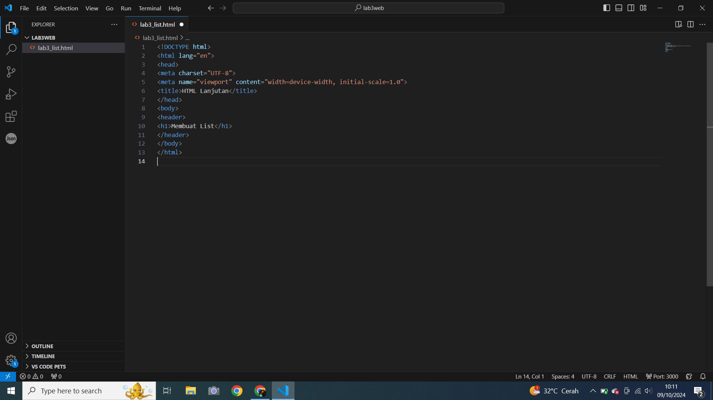
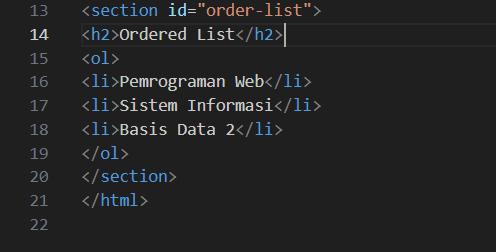
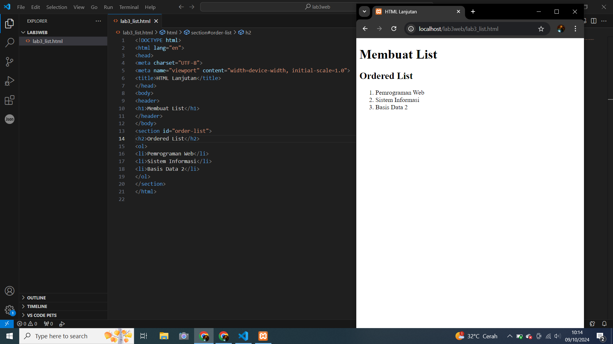
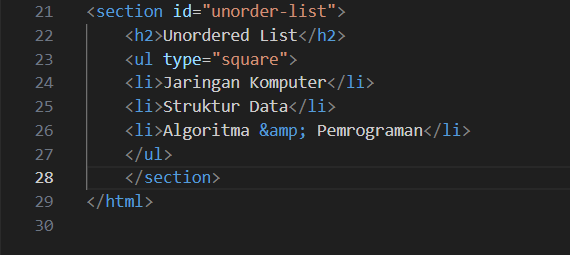
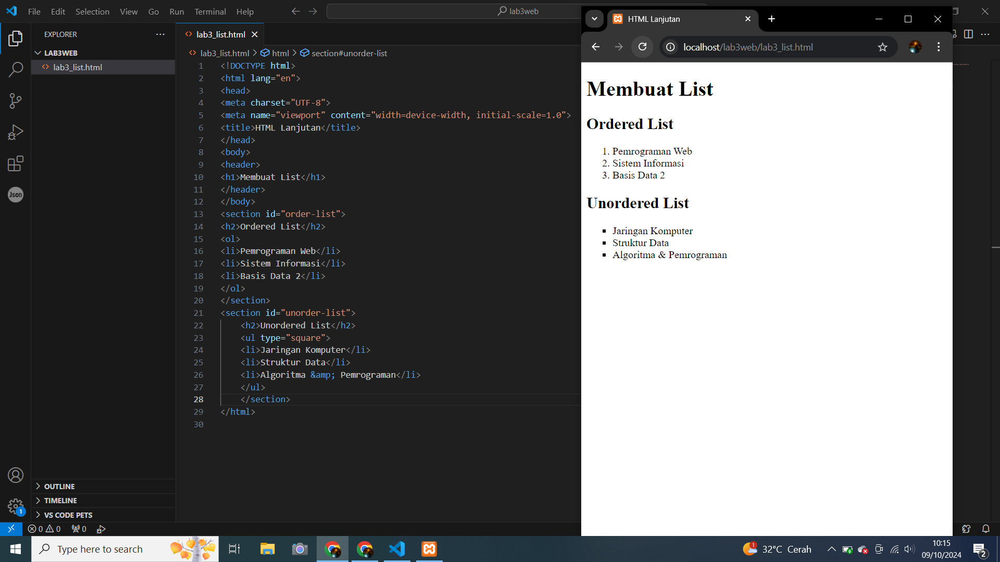
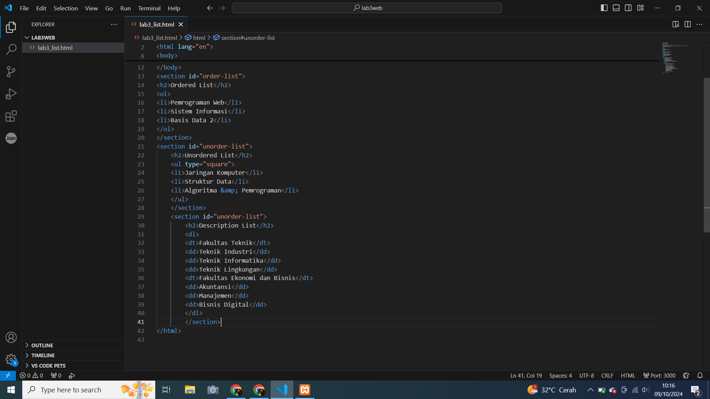
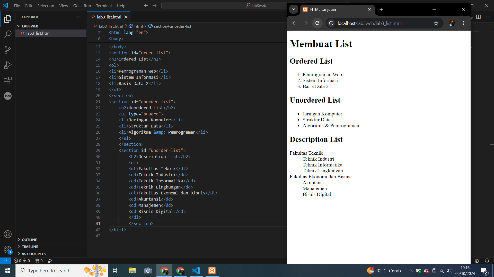
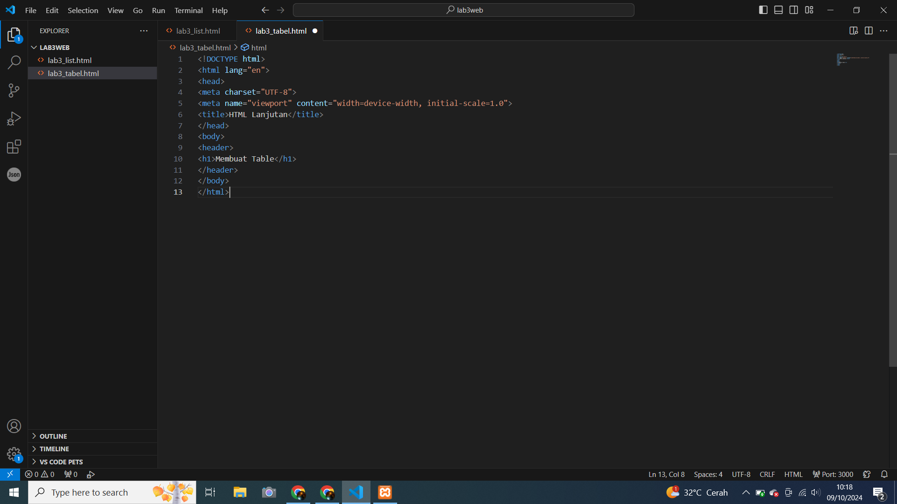
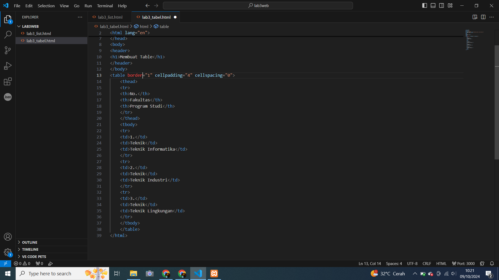
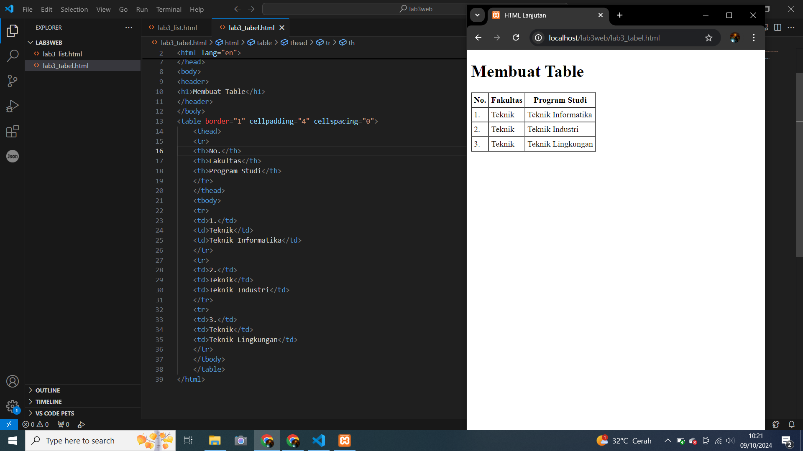

# lab3web
## Nama  : Muhamad Ananda Putra Fraceda
## NIM   : 312310440
## Kelas : TI.23.A4
## 1. Membuat dokumen HTML.
- Gambar1
  
- Gambar2
  
# 2. Membuat ordered list
- Gambar1
  
- Gambar2
   
# 3. Membuat unorderd list
- Gambar1
  
- Gambar2
  
# 4. Membuat Description List
- Gambar1
  
- Gambar2
 
# 5. Membuat Tabel
- Gambar1
  
- Gambar2
  
# 6. Mengatur Margin dan Padding
- Gambar1
  
- Gambar2
  
# 7. Menggabungkan Sel Data
- Gambar1
  
- Gambar2
  
# 8. Membuat Form
- Gambar1
  
- Gambar2
  
# 9. Menabahkan Style pada Form
- Gambar1
  
- Gambar2
  
 
